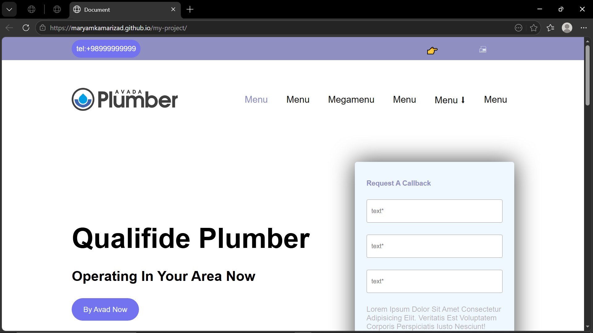

# 📸 Photography Landing Page

  <strong>A modern photography landing page built with HTML & CSS.</strong>

  <a href="https://maryamkamarizad.github.io/my-project/">🌐 Live Demo</a> •
  <a href="https://github.com/maryamkamarizad/my-project">📁 Repository</a>

---

## 📖 About

This project is a responsive photography landing page inspired by the **Avada Photography** website. It was developed to practice modern HTML and CSS techniques, including layout design, positioning, Flexbox, hover effects, and responsive interfaces.

---

## ✨ Features

* 📱 Responsive Layout
* 🎨 Modern User Interface
* 📸 Hero Section
* 🧭 Navigation Bar
* 📂 Mega Menu
* 🔍 Search Icon
* ✨ Hover Effects
* 🖼️ Background Images
* ⚡ Clean & Organized Code

---

## 🛠️ Technologies

* HTML5
* CSS3
* Font Awesome
* Google Fonts

---

## 📂 Project Structure

text
my-project/
│
├── assets/
├── images/
│   └── preview.png
├── index.html
└── README.md

## 🚀 Live Preview

**Website:**

https://maryamkamarizad.github.io/my-project/

## 📸 Screenshot

## 🎯 Skills Practiced

* Semantic HTML
* CSS Flexbox
* CSS Position
* Responsive Design
* Navigation Design
* Mega Menu Layout
* Hover Animations
* Background Images

---

## 📈 Future Improvements

* JavaScript Interactions
* Mobile Navigation Menu
* Scroll Animations
* Dark Mode
* Image Gallery

---

## 👩‍💻 Author

**Maryam Kamarizad**

GitHub: https://github.com/maryamkamarizad

---

## ⭐ Support

If you enjoyed this project, consider giving it a ⭐ on GitHub.
